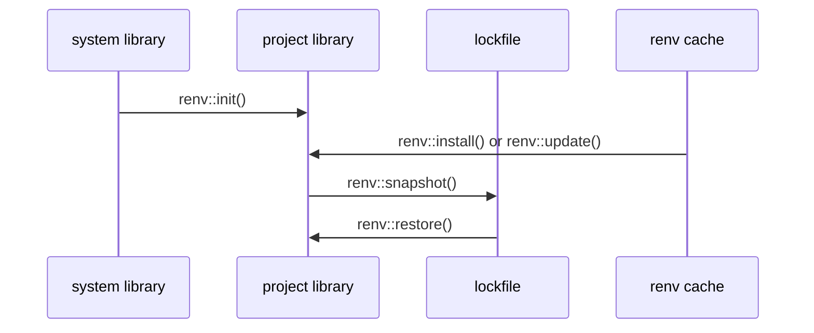

## What is it about?

- Project-based `renv` initialization script

## Renv basics



## setup
### PATH設定

`.zshrc` or `.bashrc`に以下のラインを付け足し, commandのPATHを通す

```zsh
% export PATH="<path>/Renv_setup:$PATH"
```

### `package_template`の設定

- 必要なパッケージを行単位で`package_template`以下のファイルに入力する
- 最後のラインに空行を忘れずに（parseの関係上必要）

```
devtools
ggplot2
languageserver
tidyverse
rmarkdown

```


## Usage

> Projectの開始

```zsh
% renv_init <package-template>
```

> Packageのinstall

```zsh
## shellscript
% Rscript -e "renv::install('MASS')"

## package install via R
renv::install('MASS')

## from github repository
renv::install("eddelbuettel/digest")

## update packages
renv::update()
```

> Packageのremove

```R
# remove digest from library
renv::remove("digest")
```


> 分析環境の保存

```R
renv::snapshot()
```

> 分析環境の再現

```R
# check library status
renv::status()

# restore lockfile, thereby reinstalling digest 0.6.19
renv::restore()
```


References
-------------

- [Use renv in a project](https://rstudio.github.io/renv/reference/init.html)
